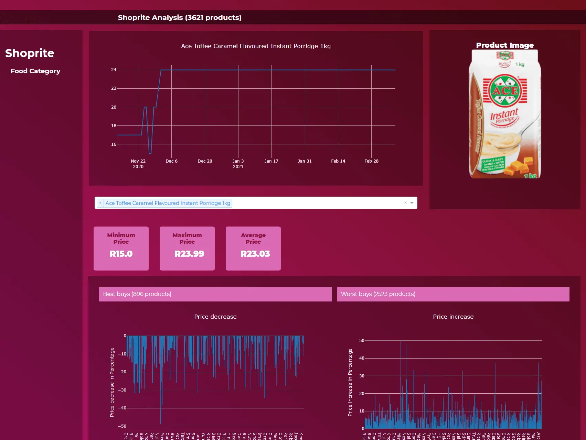

# Black Friday Plotly Dashboard

<p align="center">
  
</p>

## Overview

Have you ever wondered if the prices you see on Black Friday marked as **50% off** or **70% off** are really discounts?

Well, you are not the only one! I had the same thought too and decided to find that out through this project.

I decided to put the largest retailer in Africa to the test and scrape their product prices before, during, and after Black Friday.

## The Hypothesis

The hypothesis was that some of the retailers would mark up their prices just before Black Friday and then reduce them on Black Friday to make it seem like they have given customers huge discounts.

This dashboard helps visualize and analyze the actual price changes to validate or debunk this hypothesis.

## Features

- **Price Tracking**: Monitor product prices over time
- **Visual Analytics**: Interactive Plotly dashboards to visualize price trends
- **Category Analysis**: Compare different product categories
- **Discount Validation**: Identify genuine vs. inflated discounts

## Tech Stack

- **Frontend**: Plotly Dash
- **Backend**: Flask
- **Database**: SQLAlchemy + SQLite
- **Data Analysis**: Pandas, NumPy
- **Visualization**: Plotly, Matplotlib
- **Deployment**: Gunicorn

## Installation

### Prerequisites

- Python 3.7+
- pip (Python package manager)
- Virtual environment (recommended)

### Setup Instructions

1. **Clone the repository**
   ```bash
   git clone https://github.com/takuonline/savvy_shoprite_food_web_dashboard
   cd "savvy_shoprite_food_web_dashboard"
   ```

2. **Create a virtual environment**
   ```bash
   python -m venv env
   ```

3. **Activate the virtual environment**

   - On Windows:
     ```bash
     env\Scripts\activate
     ```

   - On macOS/Linux:
     ```bash
     source env/bin/activate
     ```

4. **Install required packages**
   ```bash
   pip install -r requirements.txt
   ```

## Running the Application

### Development Mode

Run the application locally:

```bash
python wsgi.py
```

The dashboard will be available at `http://localhost:5000`

### Production Mode

Using Gunicorn (recommended for production):

```bash
gunicorn wsgi:app --preload
```

Or using Waitress:

```bash
python wsgi.py
```

## Project Structure

```
dashapp_shoprite/
│
├── dashapp/                    # Main application package
│   ├── ecommerce/             # E-commerce dashboard module
│   │   ├── assets/            # CSS and static files
│   │   ├── data_files/        # CSV data and analysis files
│   │   ├── api.py             # API endpoints
│   │   ├── base.py            # Base configurations
│   │   ├── dashboard.py       # Dashboard layouts
│   │   └── models.py          # Database models
│   ├── base_helper.py         # Helper functions
│   ├── routes.py              # Application routes
│   └── __init__.py            # App initialization
│
├── migrations/                 # Database migrations
├── requirements.txt           # Python dependencies
├── wsgi.py                    # Application entry point
├── Procfile                   # Deployment configuration
└── README.md                  # This file
```

## Data Files

The `data_files` directory contains:
- `clean_df.csv` - Cleaned product pricing data
- `cheap.txt` - Products that got cheaper
- `expensive.txt` - Products that got more expensive
- `no_change.txt` - Products with no price change
- `non_food.txt` - Non-food category items

